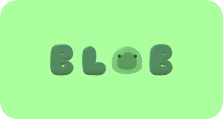
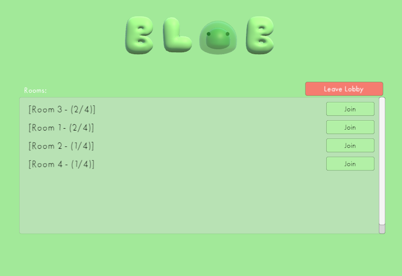
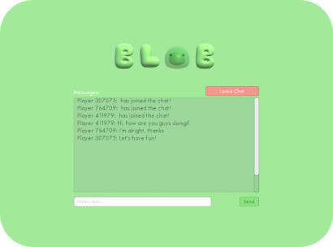
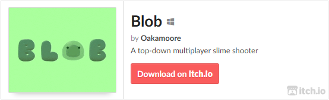

  

  
  

## Overview
**Blob** is a top-down online multiplayer arena shooter, in which players are sentient blobs of slime that shoot slime balls at each other. 

Its online multiplayer was built using [Photon Unity Networking (PUN)](https://www.photonengine.com/pun), which employs a room based system - allowing players to browse a list of user-created rooms (each supporting up to 4 players).

Each room has its own online chat - built with [Photon Chat](https://www.photonengine.com/chat) - allowing players to converse while waiting for a game to start.

| Room Selection Menu| Room Chat|
|:-:|:-:|

When a game is started players compete against each other in an enclosed arena, and whoever has the most kills at the end of a game gets their score placed on an online global leaderboard (created using [PlayFab](https://playfab.com/multiplayer/#stats)).

There's also a single player game mode, that serves as an introduction to the game's mechanics.

| Multiplayer Game| Singleplayer Game|
|:-:|:-:|

## Installation

This project was built using [Unity 2022.1.15f1](https://unity.com/releases/editor/whats-new/2022.1.15#installs), and should work as expected on that version. Downgrading or upgrading this project to a different version of Unity may cause issues. 

***
> Below are the two different ways to download this project, the **first** being the recommended approach.

### 1. Unity Hub

- Clone this repository with `git clone https://github.com/Oakamoore/blob.git`
- Open [Unity Hub](https://unity.com/unity-hub)
	- Click `Add`, browsing to the location of the previously cloned repository
	- Select the cloned repository's base directory
	- Open the newly added project via Unity Hub

### 2. Unity Package 

- Navigate to the `blob/Packages/blob.unitypackage` file in this repository, and download it
- Create and open a **new** Unity project
- In the Unity editor, under the `Assets` tab, find `Import Package`, then select `Custom Package`
- Browse to the location of the downloaded `blob.unitypackage` file, and select it 
  - Click `Import` on the `Import Unity Package` window that should appear in Unity

***
Once the project is downloaded and open in Unity, navigate to `Assets/Scenes/MainMenu`, open the scene and play (`CTRL + P`).

This project is also available over on [itch.io](https://itch.io/), as a downloadable executable:

## References

> The following is a list of links to the assets used in this project.

#### Models

- [Slime](https://sketchfab.com/3d-models/slime-creature-f176c00e63c24155b2c308b06cdb32d8) (Modified within [Blender](https://www.blender.org/))
- [Main Menu Lettering](https://sketchfab.com/3d-models/bubble-letters-ef49e3ea68f04223b173d86991c77d1c)
- [Stylised Stones](https://sketchfab.com/3d-models/stylized-stones-minipack-719d8ee393db4b218ace19ce9124918d)

#### Sound Effects

- [Shooting](https://freesound.org/people/deoking/sounds/411671/)
- [Impact](https://freesound.org/people/yottasounds/sounds/232135/)
